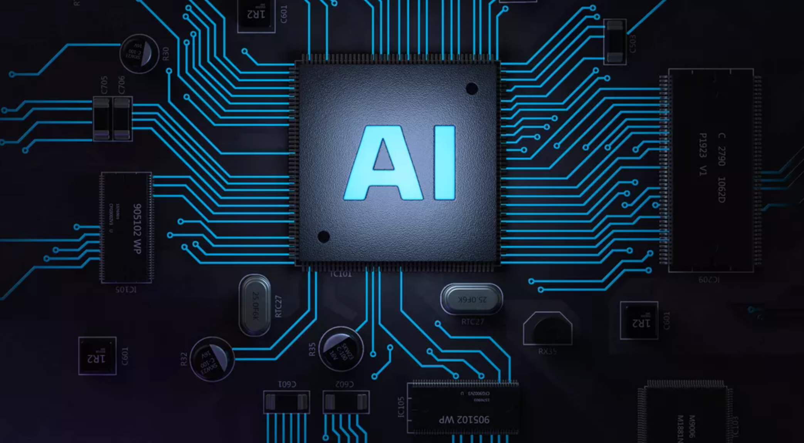
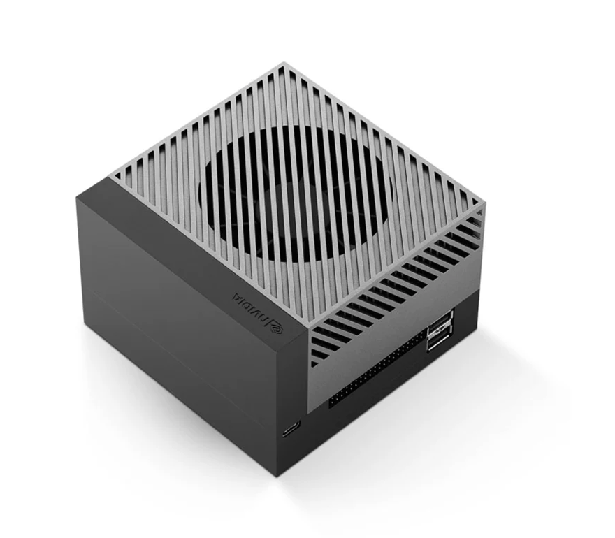
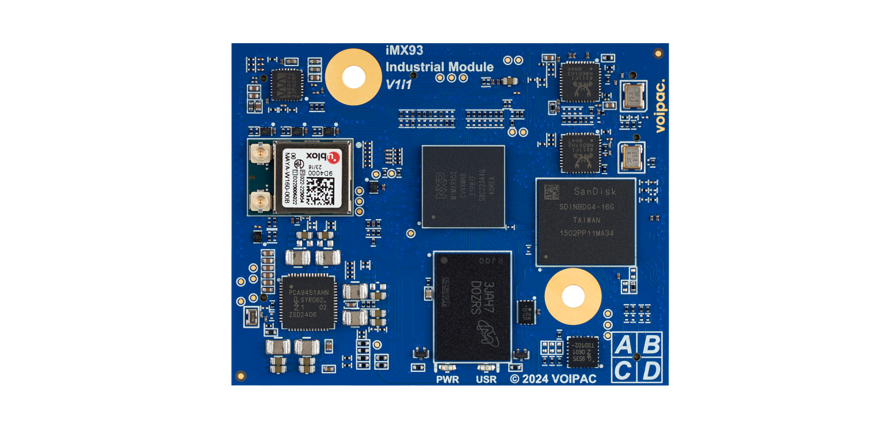

# Deploying AI models on Edge devices

## Introduction

In the rapidly evolving field of artificial intelligence, computer vision stands out as one of the most transformative technologies. From autonomous vehicles to smart security systems, the applications of computer vision are vast and varied. Traditionally, these models were deployed on powerful cloud servers, but recent advancements have enabled their deployment on edge devices. Edge devices range from high-end hardware like NVIDIA Jetson to low-end microcontrollers. This article explores the intricacies of deploying computer vision models on different types of edge devices, the challenges involved, and the potential benefits.

Edge devices refer to hardware that performs data processing at or near the data source, rather than relying on centralized cloud servers. They can be categorized into:

## High-End Edge Devices:

**NVIDIA Jetson Series**: Known for their robust GPU capabilities, they are ideal for complex models requiring substantial computational power.

**Google Coral**: Equipped with the Edge TPU, it offers efficient performance for neural network inference.

**Intel Movidius Neural Compute Stick**: Provides an easy way to add deep learning capabilities to existing systems.

## Low-End Edge Devices:

**Raspberry Pi**: A versatile, low-cost microcomputer suitable for simpler models.

**Arduino**: Primarily used for basic image processing tasks due to its limited computational power.

**ESP32**: An affordable microcontroller with integrated Wi-Fi and Bluetooth, suitable for lightweight models.

## Choosing the appropriate models and hardware

When gathering business requirements for choosing the appropriate models and hardware for a project, it's crucial to ask detailed and specific questions. These questions help to understand the goals, constraints, and operational needs of the project.

## Business Goals and Objectives

What are the primary goals of this project?

What specific problems are we trying to solve with this project?

What are the expected outcomes and success criteria for this project?

## Functional Requirements

What are the core functionalities that the system must provide?

Are there specific features that are critical for the project's success?

What types of data will the system handle?

## Performance Requirements

What are the performance expectations for the system (e.g., response time, throughput)?

Are there any specific latency or speed requirements?

What are the uptime and reliability requirements?

## Data Requirements

What types of data will be processed and stored?

What are the data volume and growth projections?

Are there any specific data security and privacy requirements?

## Integration and Interoperability

Does the system need to integrate with existing systems or third-party services?

What are the requirements for data exchange and interoperability?

Are there specific APIs or protocols that need to be supported?

By asking these detailed questions, you can gather comprehensive business requirements that will help determine the appropriate models and hardware for the project. This ensures that the solution aligns with business goals, meets user needs, and operates within the specified constraints and requirements.

## Benefits of Edge Deployment

Deploying computer vision models on edge devices offers numerous advantages:

**Reduced Latency**: Real-time processing is critical for applications like autonomous driving and security surveillance. Edge devices eliminate the latency associated with cloud-based processing.

**Enhanced Privacy**: Data is processed locally, minimizing the risk of sensitive information being transmitted to cloud servers.

**Bandwidth Savings**: By processing data locally, edge devices reduce the need for continuous data transmission, saving bandwidth and reducing costs.

## Challenges of Edge Deployment

Deploying computer vision models on edge devices is not without challenges:

**Limited Computational Resources**: Edge devices, especially low-end ones, have significantly less processing power compared to cloud servers. Optimizing models to run efficiently on these devices is crucial.

**Power Consumption**: Battery-operated edge devices need energy-efficient models to prolong operational life.

**Model Size and Memory Constraints**: Edge devices often have limited memory and storage, necessitating model compression and optimization techniques.

## Optimizing Computer Vision Models for Edge Devices

To overcome the challenges, several strategies can be employed:

**Model Quantization**: Reduces the model size by converting it from floating-point precision to lower precision (e.g., int8), which also speeds up inference.

**Model Pruning**: Removes redundant or less significant parts of the model to reduce size and improve efficiency.

**Edge-specific Frameworks**: Utilizing frameworks designed for edge devices, such as TensorFlow Lite, ONNX Runtime, or OpenVINO, can help in optimizing and deploying models efficiently.

## Model deployment Lifecycle

Deploying computer vision models on edge devices typically involves the following steps:

**Model Training**: Train the computer vision model on a powerful machine or cloud server using a large dataset.

**Model Optimization**: Apply quantization, pruning, and other optimization techniques to make the model suitable for the target edge device.

**Model Conversion**: Convert the model into a format compatible with the edge device’s framework (e.g., TensorFlow Lite, Edge TPU).

**Edge Device Setup**: Install the necessary runtime and dependencies on the edge device.

**Model Deployment**: Transfer the optimized model to the edge device and integrate it with the application.

**Testing and Validation**: Ensure the model performs accurately and efficiently under real-world conditions.

## Conclusions

Deploying computer vision models on edge devices represents a significant shift from traditional cloud-based approaches, bringing computation closer to the data source. While it presents challenges such as limited computational resources and power constraints, the benefits of reduced latency, enhanced privacy, and bandwidth savings are substantial. By leveraging optimization techniques and edge-specific frameworks, high-performance computer vision models can be effectively deployed on both high-end and low-end edge devices, opening up new possibilities for real-time, intelligent applications